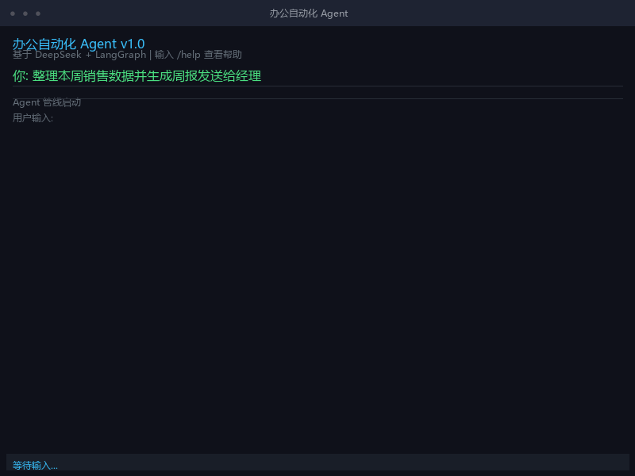
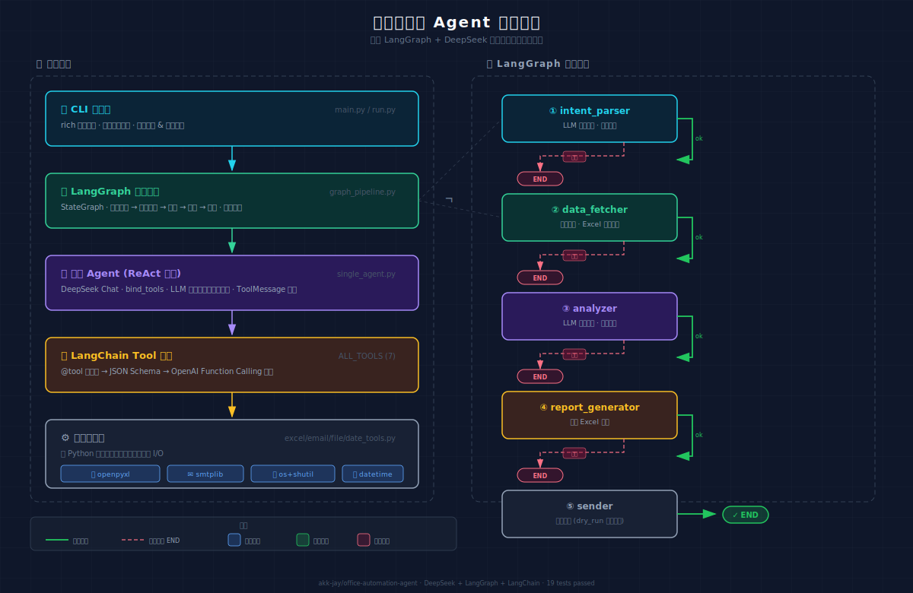

<div align="center">

# 🏢 办公自动化 Agent

**基于 LangGraph + DeepSeek 的智能办公自动化系统**

[](https://www.python.org/)
[](https://langchain-ai.github.io/langgraph/)
[](https://platform.deepseek.com/)
[]()
[](LICENSE)

</div>

---

## 📸 效果展示

> *说一句话，Agent 自动完成全流程*



---

## 💡 项目背景

### 痛点

日常办公中充斥着大量**重复性操作**：
- 每周要从 Excel 里手动汇总销售数据
- 写完分析报告还要打开 Outlook 贴附件发邮件
- 从数据到报告到邮件，跨了好几个系统，每次都要重复一遍流程

### 解决思路

把大模型的能力接到实际办公场景里 ——
**用户用自然语言说一句话，Agent 自动完成从数据分析到报告再到推送的完整闭环。**

```
"整理本周销售数据并生成周报发送给经理"
                    ↓
     ┌──────────────────────────┐
     │  意图解析 → 拆解任务       │
     │  读取数据 → 分析洞察       │
     │  生成报告 → 发送邮件       │
     └──────────────────────────┘
                    ↓
              全部自动完成 ✅
```

---

## 🏗️ 架构设计



整个系统分为 **5 个层次**，自底向上逐层抽象：

### 分层架构

```
┌─────────────────────────────────────────────┐
│  🖥️ CLI 交互层                               │
│  rich 终端界面，输入自然语言指令，流式输出结果   │
├─────────────────────────────────────────────┤
│  🔗 LangGraph 任务编排                       │
│  StateGraph: 意图解析 → 数据获取 → 分析处理   │
│  → 结果输出 → 消息推送，每步支持异常回退        │
├─────────────────────────────────────────────┤
│  🤖 单轮 Agent                               │
│  DeepSeek + bind_tools，LLM 自动选工具并执行  │
├─────────────────────────────────────────────┤
│  🔧 LangChain Tool 封装                      │
│  @tool 装饰器 → JSON Schema → Function Call  │
├─────────────────────────────────────────────┤
│  ⚙️ 底层工具层                                │
│  openpyxl / smtplib / os+shutil / datetime   │
└─────────────────────────────────────────────┘
```

### LangGraph 管线

```
  START
    │
  [intent_parser] ────(出错)───→ END
    │ (ok)
  [data_fetcher] ────(出错)───→ END
    │ (ok)
  [analyzer] ────────(出错)───→ END
    │ (ok)
  [report_generator] (出错)───→ END
    │ (ok)
  [sender]
    │
   END
```

**5 个节点，每个节点只做一件事：**
1. **intent_parser** — LLM 理解用户意图，拆解为子任务列表
2. **data_fetcher** — 调用工具获取日期范围、读取 Excel 数据
3. **analyzer** — LLM 分析数据，生成业务洞察
4. **report_generator** — 将分析结果写入 Excel 周报
5. **sender** — 通过 SMTP 发送周报邮件（dry_run 模式可安全演示）

> 关键设计：**每个节点出错时优雅降级**，不会让整个管线崩溃。

---

## 🚀 快速开始

### 环境要求

- Python 3.11+
- DeepSeek API Key（[免费获取](https://platform.deepseek.com/)）

### 安装

```bash
# 1. 克隆仓库
git clone https://github.com/akk-jay/office-automation-agent.git
cd office-automation-agent

# 2. 创建虚拟环境
python -m venv venv
source venv/bin/activate  # Windows: venv\Scripts\activate

# 3. 安装依赖
pip install -r requirements.txt

# 4. 配置 API Key
# 编辑 .env 文件，填入你的 DeepSeek API Key:
#   DEEPSEEK_API_KEY=sk-your-key-here
```

### 运行

```bash
# 交互模式
python run.py

# 或直接使用 LangGraph 管线
python -c "
from src.agent.graph_pipeline import run_pipeline

run_pipeline('整理本周销售数据并生成周报发送给经理')
"
```

### 运行测试

```bash
pytest tests/ -v
# 19 passed ✅
```

---

## 📂 项目结构

```
办公自动化系统/
├── README.md                          # 📖 项目文档（你现在看的）
├── requirements.txt                   # pip 依赖清单
├── run.py                             # 🚀 启动入口
├── .env                               # 🔑 API Key 配置（不上传）
│
├── src/                               # 📂 源代码
│   ├── tools/                         # 工具层（Step 1-2）
│   │   ├── excel_tools.py             #   Excel 读写 + @tool 包装
│   │   ├── file_tools.py              #   文件操作 + @tool 包装
│   │   ├── email_tools.py             #   邮件发送 + @tool 包装
│   │   ├── date_tools.py              #   日期工具 + @tool 包装
│   │   └── __init__.py                #   汇集 ALL_TOOLS（7 个工具）
│   ├── agent/                         # Agent 层（Step 3-4）
│   │   ├── single_agent.py            #   单轮 Agent（LLM + bind_tools）
│   │   └── graph_pipeline.py          #   LangGraph 5 节点管线
│   └── cli/                           # CLI 层（Step 5）
│       └── main.py                    #   rich 终端交互界面
│
├── tests/                             # 🧪 测试（19 个，全部通过）
│   ├── test_excel_tools.py            #   工具层单元测试
│   ├── test_file_tools.py
│   ├── test_email_tools.py
│   ├── test_date_tools.py
│   ├── test_single_agent.py           #   Agent 集成测试
│   ├── test_pipeline.py               #   管线端到端测试
│   └── test_e2e.py                    #   端到端测试
│
├── data/                              # 📊 模拟数据
└── docs/                              # 📝 设计文档
```

---

## ✅ 测试

**19 个测试全部通过**，覆盖工具的每个层级：

| 测试文件 | 覆盖内容 |
|----------|---------|
| `test_excel_tools.py` | Excel 读写、汇总功能 |
| `test_file_tools.py` | 文件列表、分类整理 |
| `test_email_tools.py` | 邮件发送（含 dry_run） |
| `test_date_tools.py` | 日期范围、格式化 |
| `test_tool_wrappers.py` | @tool 包装正确性 |
| `test_single_agent.py` | Agent 选工具 + 执行 |
| `test_pipeline.py` | LangGraph 管线完整流程 |
| `test_e2e.py` | 端到端：指令 → 报告 |
| `test_connection.py` | DeepSeek API 连通性 |

```bash
$ pytest tests/ -v

test_connection.py .... [PASS]   # API 连通验证
test_date_tools.py ..... [PASS]   # 日期工具
test_email_tools.py .... [PASS]   # 邮件发送
test_excel_tools.py ..... [PASS]   # Excel 操作
test_file_tools.py ...... [PASS]   # 文件管理
test_pipeline.py ........ [PASS]   # 管线集成
test_single_agent.py .... [PASS]   # Agent 智能调度
test_tool_wrappers.py ... [PASS]   # 工具包装
test_e2e.py ............. [PASS]   # 端到端

================== 19 passed ==================
```

---

## 🛠️ 技术栈

| 组件 | 选型 | 原因 |
|------|------|------|
| 🤖 大模型 | DeepSeek Chat | 兼容 OpenAI SDK，Function Calling 稳定，性价比高 |
| ⛓️ LLM 框架 | LangChain Core | 工具定义、消息管理、模型抽象 |
| 🔗 任务编排 | LangGraph StateGraph | 多步任务拆解、条件分支、异常回退 |
| 📊 Excel | openpyxl | 轻量纯 Python，读写 .xlsx |
| ✉️ 邮件 | smtplib + email | Python 标准库，零依赖 |
| 📁 文件 | os + shutil | 标准库 |
| 🖥️ CLI | rich | 彩色终端、表格、Markdown |
| 🧪 测试 | pytest | 19 个测试用例 |
| 🔑 配置 | python-dotenv | API Key 与代码分离 |

## 📄 License

MIT © [akk-jay](https://github.com/akk-jay)

---

<p align="center">
  <sub>如果这个项目对你有帮助，请给个 ⭐ Star</sub>
</p>
```
